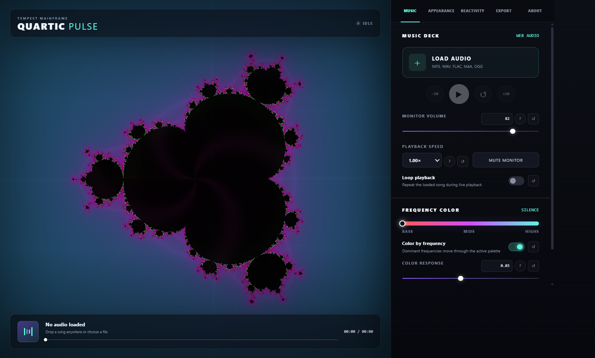

# Quartic Pulse

See [CHANGELOG.md](CHANGELOG.md) for release-by-release additions, changes, fixes, and packaging notes.

Planned export profiles and future development direction are tracked in [ROADMAP.md](ROADMAP.md).

Crash-report privacy and secure relay deployment are documented in [REPORTING.md](REPORTING.md).

Quartic Pulse is a Windows 11 music visualizer and music-to-video exporter built around an audio-reactive family of escape-time fractals. Its signature mode is the power-4 Mandelbrot set:

```text
z₀ = 0
zₙ₊₁ = zₙ⁴ + c
```

With equation modulation enabled, the music introduces a bounded quadratic term:

```text
zₙ₊₁ = zₙ⁴ + μ(t)zₙ² + c
```

Bass and beats drive the real component of `μ`, mids drive its imaginary component, and silence returns `μ` to zero—the exact quartic Mandelbrot equation. Because the renderer already computes `z²` while calculating `z⁴`, this geometric transformation adds little cost compared with changing to a non-integer exponent.

It uses WebGL2 for GPU rendering, the Web Audio API for live frequency analysis, a deterministic FFT analyzer for offline export, Electron for the Windows desktop shell, WebCodecs for frame encoding, and FFmpeg for final audio/video muxing.

Offline quality profiles include the recommended Automatic GPU Master, YouTube HEVC, compatible H.264, VP9 WebM, AV1 WebM, ProRes MOV, Ut Video and FFV1 lossless MKV masters, plus an interruption-safe PNG sequence folder with matching 24-bit WAV audio and a sequence manifest.



## v0.29 performance intelligence and reporting

- Music Personality profiles and deterministic Song Maps analyze a complete local track and provide genre-aware frequency boundaries, smoothing, beat recognition, tempo, energy, and musical sections.
- The Mathematical Song Director converts those sections into smoothly blended camera, equation, palette, dimensional, fold/warp, Mandelbulb, and pulse-shape direction while preserving user presets.
- Performance Packages, Performance Mode, emergency blackout, the Show Sequencer, and the expanded Show Composer form a portable live-show workflow with editable cues and automation lanes.
- System → Reports captures sanitized local incidents and creates reports that can be copied, saved, printed to PDF, opened in GitHub, or submitted through the separately deployed secure relay.
- The public Azure Functions relay reference lives in `tools/report-relay`; Discord credentials remain private server-side settings and never enter Quartic Pulse source or packaged applications.

## v0.28.6 touch, transport, and visual refinements

- Windows touchscreen systems now support one-finger canvas manipulation, two-finger pinch zoom and pan/orbit gestures, smooth one/two-finger handoff, touch-sized controls, and a wider sidebar resize target.
- The deck timeline supports continuous mouse, pen, and touch scrubbing with pointer capture, plus keyboard seeking with Arrow, Shift+Arrow, Home, and End.
- Selecting a new song immediately resets the centered transport to its Play state.
- The 3D Mandelbulb keeps recurrence powers on seamless whole numbers while music drives continuous Cartesian recurrence warping and localized surface motion.
- Mainframe Room contour response now favors architectural detail and compresses intense highlights so energetic passages retain depth.

- Export preflight now verifies the final encoder, estimates output and temporary-master storage, checks free disk space again at the chosen destination, and offers a five-second test render before committing to a full song.
- Automatic GPU Master is the recommended 10-bit MP4 profile. It selects hardware AV1 when the installed GPU supports encoding it, hardware HEVC Main 10 on GPUs such as the RTX 3080, or CPU HEVC as a universal fallback. It never chooses CPU AV1 automatically.
- Advanced Export includes an expandable Encoder Compatibility scan showing which AV1, HEVC, and H.264 GPU/CPU encoders successfully initialize on the current PC and why Automatic selected its recommended path.
- The Export Readiness benchmark measures the selected encoder without creating a video, combines it with the current visual workload and export-detail target, identifies whether rendering or encoding is likely to be slower, and estimates export time per minute of music. CPU AV1 stress tests are skipped intentionally.
- After benchmarking, the Setting Advisor offers Faster Turnaround, Balanced Master, and Maximum Detail combinations with their estimated time cost. Applying one changes resolution, frame rate, and export iterations without changing the selected codec or visual design.
- Advanced Export includes a 10-bit AV1/Opus WebM upload master. Quartic Pulse prefers supported NVIDIA, Intel, or AMD hardware and labels the CPU libaom fallback as very slow before rendering begins.
- Final H.264 encoding automatically prefers a verified NVIDIA NVENC path, then Intel Quick Sync or AMD AMF when available. CPU x264 remains the universal quality fallback and is retried automatically if a hardware encoder fails.
- Installer and portable releases carry their own FFmpeg executable and license notice, so exporting does not depend on FFmpeg being installed separately on the destination Windows 11 PC.
- Offline rendering shows elapsed time and an adaptive ETA, supports Pause/Resume between exact frames, confirms destructive cancellation, and keeps End & Finish for producing a valid shortened video.
- Interrupted offline jobs retain recoverable frame data and appear under Recoverable Exports on the next launch. Completed exports have a local history with encoder, dimensions, size, Open, and Folder actions.
- Quartic Pulse autosaves the current visual session and last local song every ten seconds, restores sessions for up to 30 days, and reopens the previous play position when that file is still available.
- Saved profiles and the 20-equation library now include search and favorites. A live Visual Safety Estimate labels the current combination Calm, Active, or Intense based on motion, color, equation deformation, folding, beat response, and measured audio energy.
- Beat detection now uses a dedicated, lightly smoothed 30–520 Hz onset analyzer with a fast envelope, adaptive baseline, and cooldown. It remains responsive even when the main visual analyzer uses heavy smoothing.
- Beat Sensitivity and Beat Cooldown controls are available in Reactivity > Advanced and are included in full saved profiles.
- Chroma-safe green screen mode reserves pure green for the keyed background and shifts green-dominant subject colors away from the OBS key range.
- The frameless OBS output can be repositioned by dragging the transparent strip along its top edge, and changing its output settings no longer recenters it.
- Export progress now separates frame rendering, encoder flushing, final encoding/muxing, and destination saving. Frame rendering stops at 80%, the completed encoder flush reaches 85%, and 100% is reserved for a successfully closed final file, with OneDrive destinations identified in the status.
- An optional completion stinger sounds only after an exported video has been fully saved; the preference is available in the Export tab.
- Offline exports use a high-bitrate quality master tied to Export Detail, prefer the stable software VP9 path, and finish MP4/MOV/MKV at H.264 CRF 14 to preserve dense, fast-moving fractal detail.
- The centered export-status card remains visible during both Offline and Live exports, including when the visual preview stays enabled, with mode-specific rendering and saving messages.
- Export status provides separate **End & Finish** and **Cancel Export** actions. End & Finish saves a shortened valid video at the current point; Cancel discards the active job and its temporary output.
- Export progress is mode-locked: Offline muxing/finalization can no longer be overwritten by Live recording progress from the deck-time UI updater.
- Custom palette fields use the descriptive roles Shadow Color, Field Color, Accent Color, and Detail Color while preserving existing HEX/RGB data and profile compatibility.

## Run in Visual Studio Code

1. Install [Node.js LTS](https://nodejs.org/) and open this folder in VS Code.
2. Open the integrated terminal (`Ctrl` + `` ` ``).
3. Install dependencies:

   ```powershell
   pnpm install --frozen-lockfile
   ```

   Release packaging also requires a GPL-enabled 64-bit Windows FFmpeg 8.1.2 or newer build on PATH. `pnpm run dist` automatically runs `pnpm run bundle:ffmpeg`, verifies the security and licensing baseline, copies FFmpeg and its notices into the packaged application, and keeps the large executable out of the Git repository.

4. Start the app:

   ```powershell
   pnpm start
   ```

You can also press `F5` and choose **Run Quartic Pulse**. The included `.vscode/launch.json` starts Electron with DevTools open.

## Using the visualizer

- Click **Load Audio** or drag an audio file onto the visualizer.
- To add an authored visualizer, export a **Quartic Pulse visualizer package** from Data Horizon. In Quartic Pulse, open **Visuals**, find **Custom visualizer packages**, click **Preview Data Horizon Export**, and choose the exported folder. Quartic Pulse shows the identity, version, file size, and included palette count before installation. The package remains installed between launches and appears in the normal visual-style browser and selector; use the package list there to remove it later. The complete export contract is in [DATA_HORIZON_PACKAGE_SPEC.md](DATA_HORIZON_PACKAGE_SPEC.md).
- Quartic Pulse validates the package manifest, project, palettes, assets, paths, size limits, WebGL2 target, audio contract, transport clock, and offline-frame support before installing it. It renders the authored `project.horizon.json` through its built-in compatible Data Horizon engine and does not execute JavaScript contained in an imported package. This keeps package code outside Quartic Pulse's runtime and avoids adding a per-visualizer software dependency or license to the application.
- Imported visualizers receive deterministic Bass, Mids, Highs, Beat, Overall Level, and transport-time data in both the main preview and OBS Output. Offline rendering currently supports them through the SDR/8-bit H.264, VP9, ProRes, Ut Video, FFV1, and PNG Sequence profiles; Quartic Pulse blocks the 10-bit/HDR profiles for imported visualizers until their native render path gains an HDR framebuffer.
- Quartic Pulse's bundled Data Horizon 0.10 renderer supports native image, group, text, shape, spectrum, waveform, particle, and animated path layers, along with the complete Data Horizon effect set. Authored audio bindings and timeline keyframes run from the same deterministic transport clock in preview, OBS, and offline export.
- Custom colors use the existing portable profile system. Choose **Custom**, edit the four color roles, and click **Save to My Palettes**; saved and imported Color Palette profiles become named gradient cards directly below the built-in color systems. A Data Horizon package may also carry up to 32 named four-color palettes. They are attributed to their package, update by stable ID, and leave the library when their package is removed. Favorites sort first, and ordinary Color Palette profiles can still be exported or imported on another PC.
- A Full Visual Settings profile records the package ID of an active custom visualizer. The visualizer bundle itself remains a separately installed Data Horizon export rather than being duplicated inside every profile. If a shared profile refers to a package that is not installed, Quartic Pulse applies its other settings and identifies the missing package.
- Under **Windows Audio Source**, choose any Windows playback endpoint captured directly through WASAPI loopback, including separate SteelSeries Sonar Gaming, Chat, Media, Stream, and Aux channels. Microphones, line-in, and virtual recording inputs remain available in their own group. **Refresh Devices** rescans both kinds of endpoint and requests permission for friendly input names. Live sources drive the analyzer without being played back through the app, preventing echo and microphone feedback.
- Open **Music → Playlist** to add multiple local files, import a local music folder, reorder the queue, or move between songs.
- Open **Music → Analysis** to choose a Music Personality and create a cached **Song Map** for the selected local track. The map shows energy, low/mid/high balance, detected beats, estimated BPM, and labeled structural sections. Drag or tap the map to seek, use its keyboard arrows for five-second steps, or select a section card to jump directly to it. Maps are stored per track and analyzer profile, and analysis work is capped to roughly 1,400 FFT windows even for long recordings.
- After a Song Map is ready, enable the **Mathematical Song Director** to turn its Intro, Build, Peak, Breakdown, Bass Drive, Lift, Movement, and Outro sections into a smooth visual performance. Within each section, multi-second energy and frequency contours make the equation, camera, color, depth, and optional fold systems breathe with the musical phrase instead of jumping on individual beats. Similar returning sections are assigned a visible visual motif, so a later chorus or recurring bass passage recalls its earlier directional motion while following the new passage's energy. Subtle, Cinematic, Mathematical, and Storm styles emphasize different combinations of that motion. The Director is non-destructive, never rewrites the selected preset, and follows the same deterministic motion during playback, OBS output, and offline export. Dimensional and fold/warp cues only participate when those optional systems are already enabled.
- The compact Director dynamics monitor labels Camera, Math, Color, and Depth activity and reports the current musical driver-to-target relationship, such as `BASS → MATH`. It is a read-only explanation of the performance rather than another control layer.
- **Transition Feel** changes how one Song Map section flows into the next. Auto follows the chosen Musical Behavior, Gentle uses long soft blends, Balanced keeps even pacing, and Theatrical focuses the change into a shorter dramatic window. All four remain bounded continuous blends rather than cuts, and the choice is preserved in saved profiles, restored sessions, OBS state, and portable Performance Packages.
- **Musical Behavior** changes how the Director reads that structure. Auto follows the Music Personality stored when the Song Map was analyzed; Balanced, Electronic / EDM, Hip-Hop, Rock / Metal, Pop, and Ambient / Classical can also be selected manually. These are transparent behavior curves rather than automatic genre claims: they adjust transition speed and the relative emphasis on bass, mids, highs, camera movement, equation pressure, color, depth, folding, and pulse shape.
- Select any Director section cue to edit just that part of the song. **Section Strength** can reduce an automatically generated cue from 100% down to stillness, while **Emphasis** can favor Camera, Equation, Color, Dimension, or Fold / Warp behavior. Edited cues are marked on the timeline, cached locally for that Song Map, smoothly blended into neighboring sections, and can be returned to Auto with one button.
- Open **Perform → Show → Performance Package** to archive or share a complete reproducible show as `.quartic-performance.json`. The package contains the current visual, modulation matrix, Mathematical Song Director settings, deterministic Song Map, section cue edits, beat-grid configuration, show sequence, and only the saved profiles referenced by that sequence. A content fingerprint detects damaged or modified packages during import.
- Performance packages never contain song bytes, source URLs, or local file paths. They store only a portable track fingerprint made from the audio file name, size, and analyzed duration. When the matching local song is loaded on another PC, Quartic Pulse attaches the packaged Song Map and cue edits automatically; otherwise the imported visuals and show remain usable without audio.
- **Performance Mode** turns the main window into a distraction-free operator view by hiding the setup sidebar and expanding the visual across the entire stage. Fullscreen and music-HUD visibility are optional. A compact dock keeps the current and next show profiles, cue progress, Previous, Start/Pause, Next, Blackout, and Exit controls available over the visual.
- While Performance Mode is active, Space starts or pauses the show, Left/Right changes cues, B toggles blackout, and Escape exits. Blackout is synchronized to the separate OBS Output window and is available as a MIDI, keyboard, or OSC mapping for a hardware panic button.
- Outside Performance Mode, press **Space** to play or pause the music deck.
- Use the Music tab to skip by ten seconds, restart, mute the monitor, change listening volume or playback speed, and loop a track.
- Use **Deck Playback Output** to send loaded songs directly to a Windows playback endpoint such as SteelSeries Sonar Gaming, Media, Chat, Stream, or Aux. This is also the reliable routing path while the VS Code development build is hosted by `electron.exe`.
- Enable **Color by frequency** to move through the selected preset or custom palette according to the dominant bass, mid, or high-frequency energy.
- Every numerical slider includes an editable number box, a **?** tip button, and a **↺** reset button. Dropdowns, switches, palettes, and custom colors also include reset controls.
- Drag the fractal to pan and use the mouse wheel to zoom.
- Press **R** to reset the view.
- Choose from 20 named 2D equations in the Fractal Equation menu, including Mandelbrot and Multibrot powers, Julia, Burning Ship variants, Phoenix, Magnet, Lambda, Newton, Nova, and Pickover Biomorph. The power-4 Mandelbulb remains available as the separate true-3D visual.
- Choose **Fractal**, the true ray-marched **3D Mandelbulb**, or a conventional **Spectrum Bars**, **Radial Spectrum**, **Pulse Rings**, or **Waveform Field** presentation from the Visuals menu. Appearance shows only the controls and presets that apply to the selected style. Conventional modes skip fractal iteration for lower GPU cost; every style uses the active palette and music analysis and is rendered into exported videos.
- **3D Mandelbulb** uses a distance-estimated whole-number recurrence and GPU ray marching to produce genuine surface depth, perspective, lighting, and camera orbit. Drag the canvas to orbit, use the mouse wheel for camera distance, and start from Quartic Core, Deep Orbit, Storm Fold, or Neon Shell. Whole-number powers keep the spherical recurrence seamless while bass, mids, highs, beats, and mapped power modulation drive continuous Cartesian recurrence warping, localized surface motion, camera breathing, orbit, and light. Adaptive mode scales live resolution and ray steps; offline export and Unleashed mode use a higher step budget.
- Fractal equations use a separate compressed audio envelope with adjustable **Equation Smoothing**. The 90% default slows topology changes and suppresses beat-to-beat strobing without making Spectrum Bars, Pulse Rings, or the music meters less responsive. Equation Modulation now defaults to 6% and remains adjustable in Advanced Reactivity.
- **Basic mode** now leads with visual preview cards, Low Flash/Balanced/Expressive response presets, equation-aware starting points, four ready-made palettes, and larger quick controls. **Advanced mode** retains the complete equation, modulation, custom-palette, profile, dimensional, folding, and performance toolset.
- A first-run visual-safety notice explains possible flashing, contrast, and motion effects. **Low Flash** disables beat scaling and GPU-intensive folding/depth features while substantially reducing color movement, camera motion, pulse density, and equation deformation.
- **Appearance navigation** uses Overview, Reactivity, Dimension, and Folding subtabs. Overview keeps visual selection, palettes, the two GPU-intensive feature toggles, and safe core-equation editing. The other subtabs keep presets visible while fine tuning remains collapsed under Advanced Settings.
- **Fractal Dimensional Rotation** is an optional GPU-intensive mode that is off by default. When enabled from Appearance Overview, its dedicated Dimension subtab rotates the complex sampling plane through virtual depth, applies perspective, moves through a changing depth slice, and adds depth lighting. Dimensional, Classic, Deep Orbit, and Dream Fold presets provide starting points.
- **Equation Fold & Warp** is a separate optional GPU-intensive mode that is off by default. When enabled from Appearance Overview, its dedicated Folding subtab folds and nonlinearly warps the complex value inside every recurrence step. Soft Fold, Kaleidoscope, Liquid Equation, and Static Mirror presets provide starting points. Because these transforms compound across iterations, v0.28 uses perceptual response curves instead of sending the UI percentage into every recurrence linearly. Low and middle settings now retain the original fractal while Music Fold adds smoothed movement; the upper range still reaches strongly mirrored structures. The nonlinear warp remains bounded to prevent unstable coordinate growth.
- **Core equation editing** exposes the recurrence constant's influence plus real and imaginary bias. These fields modify Mandelbrot-family `c` values and the Julia constant directly without accepting unreliable free-form shader code. A 50% influence with zero bias preserves the selected equation's original form.
- Appearance and reactivity intensity controls use normalized 0–100% input scales. Directional controls and equation biases use centered −50% to +50% scales. Domain-specific values such as frequency boundaries, zoom magnification, and iteration counts retain Hz, magnification, and iteration units.
- **Spectrum Bars** includes Balanced, Neon, Mirror Hall, and Wave Dance presets. Basic controls adjust bar width, neon glow, and top-edge reflection; Advanced controls add music-driven motion warp, animated peak echoes, and grid intensity.
- **Radial Spectrum** includes Balanced, Halo, Starburst, and Orbit Echo presets. Basic controls adjust ring size, halo glow, and fading wave echoes; Advanced controls add angular twist, spoke intensity, and the surrounding color atmosphere. Its frequency mapping remains mirrored for a continuous circle.
- **Pulse Rings** uses an explicit three-layer composition: radial texture in back, music-emitted waves in the middle, and the compact three-lane center emitter in front. Emitted waves are masked beneath the emitter, emerge beyond its outside edge, and dissolve with distance and age. Simultaneous low, mid, and high attacks are combined into one strongest musical event, and each accepted event emits one ring. **Pulse Density** controls transient sensitivity, the shared creation delay, and a small active-ring budget; at the 75% Balanced default it permits at most three traveling event rings. **Ring Size** controls the full composition scale, and **Creation Cooldown** lengthens or shortens the shared delay between accepted events. The expandable Advanced section contains **Pulse Jaggedness**, **Pulse Trails**, and **Pulse Detail** for frequency-shaped edges, inward fading wakes, sharp echo ridges, and fine concentric structure.
- Drag the glowing edge on the left side of the settings panel to resize it. The controls scale with the panel, and the chosen width is remembered. Double-click the edge to restore the default width.
- Open **Stream → OBS Studio** to launch a clean, borderless **Quartic Pulse — OBS Output** window at 720p, 1080p, 1440p, or 4K. Add that window to OBS as a Window Capture source while keeping the main Quartic Pulse controls open. The output mirrors the selected visual, palette, equation settings, and live music analysis at 30 or 60 FPS. The lower-load 30 FPS mode is the default. Quartic Pulse keeps audio analysis and OBS state delivery active when the control window is unfocused, and automatically suspends that hidden window's duplicate WebGL preview and interface updates until it returns to the foreground.
- **Green-screen background** replaces dark output pixels with pure chroma green without changing the main preview. Adjust **Key Threshold** to preserve or remove darker visual detail, then add OBS's Chroma Key filter to the Window Capture source. Stream audio remains configured separately in OBS to prevent duplicate or delayed sound.
- Open **Appearance → Saved Profiles** to store named configurations on the current PC. **Color Palette** profiles contain the active preset/custom colors and frequency-color behavior; **Full Visual Settings** profiles additionally contain the selected visual or fractal equation, camera location, reactivity, frequency bands, dimensional and folding controls, conventional effects, pulse settings, and export/stream preferences. Saving the same name and type updates that profile.
- Saved profiles can be exported as readable `.quartic-pulse.json` files and imported on another Quartic Pulse installation. Imported files are schema-checked before being stored or applied.
- **Appearance → Mapping** contains the Audio Modulation Matrix. Up to eight routes can connect Bass, Mids, Highs, Beat, or Overall Level to Equation Modulation, Equation Fold/Warp, Dimensional Tilt/Slice, Camera Zoom, Rotation, Color Position/Flow, Visual Motion, or Pulse Jaggedness. Each route provides signed amount, attack and release speed, an input floor and ceiling, live activity metering, enable/bypass, manual numerical entry, and reset controls.
- Math Drive, Deep Motion, Conventional, and Mandelbulb-specific 3D Pulse modulation presets provide safe, visual-aware starting points. The Mapping panel lists the active visual's supported targets and pauses incompatible saved routes without deleting them. Rotation routes drive angular velocity rather than directly replacing the current angle, so a Beat source creates a brief smooth acceleration instead of a jarring whole-frame rotation jump. Color Position routes remain active independently of Color by Frequency. Matrix routes are saved locally, included in Full Visual Settings profiles, synchronized with the OBS output window, and applied during deterministic offline or Unleashed live export without changing their underlying base controls. Imported Data Horizon visualizers use the bindings authored in their package.
- Adjust detail, palette, flow, reactivity, motion, rotation, beat pulse, and automatic drift from the right panel.
- Use **Equation Modulation** to control how strongly the music changes the fractal geometry itself. Set it to zero for the original equation.
- Choose a resolution from 480p through 4K and a frame rate from 30 through 120 FPS, then click **Export Video**. Offline mode is the default: it decodes the song, calculates audio data at every exact frame timestamp, waits for each GPU frame to finish, encodes it, and combines the original audio afterward. Slower computers take longer instead of silently dropping requested frames.

Settings are organized into five scalable workspaces:

- **Music** contains **Deck**, **Playlist**, **Analysis**, and **Color**. It provides local audio import and playback, endpoint-specific Windows WASAPI capture, local queues, frequency-driven color, Music Personality profiles, cached Song Maps, and the Mathematical Song Director. The profiles give a basic user musical starting point while advanced users can still edit continuous frequency boundaries, smoothing, and beat detection. Network audio links and radio streams are intentionally unsupported. Live Windows sources visualize in real time but cannot use whole-song mapping or the song-to-video exporter because they have no fixed duration.
- **Visuals** contains the visual browser, palettes, reactivity, dimensional controls, fold/warp, and music mapping. Basic mode keeps the visual choices and practical presets in view; Advanced mode opens the complete equation and modulation system.
- **Perform** contains **Show**, **Controls**, **Camera**, **Tools**, and **Stream**. It groups beat-synchronized sequencing, MIDI, OSC, keyboard control, camera paths, randomization, capture, now-playing presentation, OBS output, and OBS WebSocket automation in the same live-performance workspace.
- **Export** contains resolution, user-editable export iterations, Standard/Balanced/Maximum clarity sampling, frame rate, quality profile, encoder guidance, preflight, recovery, and recording controls.
- **System** contains **Performance**, **Reports**, and **About**. It groups hardware detection, adaptive quality, performance presets, live frame protection, optional Unleashed mode, privacy-conscious crash and bug reports, project information, licensing, and branding.

The custom palette editor accepts a native color picker, six-digit HEX values, or individual 0–255 RGB values. All three input formats stay synchronized.

The **About** tab identifies Tempest Mainframe as the creator and maintainer, displays the Storm Horizon Media branding, summarizes the rendering stack, and explains the GPL-3.0-or-later source-code license.

The application icon is a fractal interpretation of the Storm Horizon symbol. Its source master is stored in `assets/quartic-pulse-fractal-logo-master.png`; the Windows build and development window use `assets/icon.png`.

The analyzer maps approximately 25–180 Hz to bass, 180–2,400 Hz to mids, and 2,400–12,000 Hz to highs. Those bands drive breathing zoom, camera orbit, rotation, moving orbit traps, color flow, luminance, and a bounded equation term tailored to the selected fractal. Frequency color computes a smoothed spectral position from those same bands: bass selects the low end of the active palette, mids the center, and highs the upper end.

Frequency bands offer **Basic** and **Advanced** modes. Basic uses the recommended 25 Hz, 180 Hz, 2,400 Hz, and 12,000 Hz boundaries. Advanced lets the user edit the analysis floor, low/mid split, mid/high split, and analysis ceiling with sliders or numerical entry. Quartic Pulse keeps these boundaries ordered and continuous automatically, preventing gaps and overlaps while applying the custom bands to meters, frequency color, beat detection, motion, and equation modulation.

**Auto reactivity** keeps the same dB-based frequency analysis while automatically adjusting its gain toward a 74% peak target. It turns loud tracks down quickly and raises quiet tracks gradually, with a 96% safety ceiling so the meters and visuals do not remain pinned at 100%. The Reactivity slider remains the base sensitivity; turn Auto reactivity off for fully manual gain.

The main fractal body carries the strongest response: bass and beats drive its breathing and boundary flash, mids move waves through its interior, and highs add a finer counter-wave. Orbit-trap lines retain a quieter treble shimmer so they support rather than overpower the quartic body.

**Export Iterations** directly controls the mathematical depth of 2D fractal exports. Choosing a resolution loads a practical starting recommendation—320 at 480p, 400 at 720p, 600 at 1080p, 800 at 1440p, or 1000 at 4K—but the displayed value remains fully editable and is the value the renderer uses. The standard ceiling is 1,200 iterations; Unleashed mode raises it to 2,400.

**Export Clarity** controls how many stable subpixel renders are averaged in linear light before each frame reaches FFmpeg. Standard uses one grain-free render per frame for the fastest result. Balanced Clarity uses two opposed rotated samples and is recommended for dense fractal detail above roughly 300 iterations; it normally costs about twice the Standard render time. Maximum Clarity uses four rotated samples for the cleanest final master and normally costs about four times the Standard render time. Sampling does not increase bitrate by itself.

**Adaptive live quality** watches frame time and can reduce only the live render scale to 62% when necessary. It gradually restores full resolution when the GPU has headroom. Export resolution and export iteration detail are never reduced by this setting.

The export tab disables the onscreen preview by default while recording. The WebGL canvas continues producing every video frame, but Electron avoids displaying that canvas and the interface updates only ten times per second, reducing composition and UI overhead. Enable **Show preview while exporting** when monitoring is more important than the small resource saving.

## Live performance and stream control

- The **Show Sequencer** arranges saved profiles into a performance. Entries can advance after a chosen number of beats or seconds, cut immediately, or fade through black. Automatic BPM detection, tap tempo, manual BPM, beat offset, looping, and shuffle are included.
- **Show Composer** turns that sequence into a full-window timeline. Use **Build from Song Map** to create precisely timed cues from analyzed song sections, or add cues manually. Each cue can choose a saved profile, transition, camera path, and optional Director, motion, equation, and color-flow automation; blank automation fields continue to inherit the profile.
- Composer cue cards can be selected to apply their visual and seek the loaded song to the matching show time, dragged to reorder, moved with accessible buttons, or snapped back to the corresponding Song Map section. The global playhead and automation lanes remain synchronized with the normal Show transport and Performance Mode.
- **Record Automation** writes supported live control changes into the selected cue without altering its saved visual profile. Composer data is stored with the Show Sequencer and is included in portable Performance Packages.
- **OBS Automation** connects only to OBS WebSocket on `127.0.0.1`. Its password remains in memory and is never saved. It can switch scenes, show or hide scene sources, create a Window Capture input, and apply a linked Quartic Pulse profile whenever the OBS program scene changes.
- **Live Controls** stores up to 40 mappings. MIDI Note and Control Change messages support learn mode and continuous visual values. Keyboard mappings work while Quartic Pulse is focused. The OSC UDP server listens only on localhost by default; LAN listening requires the explicit **Allow LAN controllers** switch.
- **Camera Paths** save exact center and zoom bookmarks, interpolate between two views with Linear, Smooth, or Cinematic easing, and can loop back and forth. Slow Orbit, Deep Drift, and Zoom Breath provide bookmark-free motion.
- The **Safe Randomizer** offers Gentle, Bold, and Chaos variations with separate locks for visual type, equation, colors, motion, reactivity, and camera. One-step undo restores the exact pre-randomized visual settings.
- **Quick Capture** saves the current WebGL canvas as PNG or records a 5, 10, or 15 second MP4 clip through the existing streaming export pipeline. The full Export tab remains the correct choice for full-song, high-detail output.
- The **Now Playing** card can use the loaded filename or custom title and artist text. It appears in the main stage and OBS output window at any corner without changing the underlying fractal.
- The **Performance Assistant** measures an eight-second frame-time sample, reports typical FPS and 95th-percentile frame time, recommends a safe live iteration count, and can disable simultaneous heavy equation effects when necessary. Average PC, Balanced, and Showcase presets are also available. Adaptive protection changes only live render scale; export detail remains independent.
- Quartic Pulse reads local CPU thread count, installed RAM, active GPU information, driver feature status, and reported video memory where the driver exposes it. Automatic mode combines those facts with the optional live benchmark to recommend Efficient, Balanced, or Performance settings. Hardware discovery is advisory and never locks the user out of a visual.
- **Unleashed mode** is an explicit Advanced Performance switch. It raises the live base-iteration limit from 500 to 800 and the shader/export ceiling from 1,200 to 2,400. Absolute limits remain in place.
- **System → Reports** captures up to 20 sanitized incidents locally and creates a paste-ready Markdown report. Users can Copy, Save Text, Print/PDF, or open a new GitHub issue. Nothing is sent automatically, and diagnostics are optional.
- Online report submission uses an independently hosted HTTPS relay. Direct Discord webhook hosts are rejected so the webhook bearer token is never embedded in the public source or EXE. See `REPORTING.md` for the Azure relay contract and security checklist.

## Advanced GPU output boundary

The built-in OBS output uses a borderless visual-only window and works without native plugins. Quartic Pulse also detects an optional native sender at `assets/spout/QuarticPulse.SpoutSender.exe`, but it does not claim to implement Spout2 in JavaScript. True Spout2 output requires all of the following:

1. A compiled 64-bit Direct3D texture-sharing sender linked against the Spout2 SDK.
2. A narrow, audited native bridge that receives Quartic Pulse frames without exposing Node.js to the renderer.
3. Code signing for the native executable so Windows 11 distribution does not introduce another untrusted binary.
4. The matching OBS Spout2 source plugin on the streaming PC.

Until that signed native add-on is supplied, **OBS Window Capture** is the supported low-setup path. The Stream tab reports this capability honestly and will detect the optional sender file if it is added later.

## Video formats

All full-song exports use deterministic offline rendering. Quartic Pulse completes one exact visual frame at a time and streams it directly into the selected bundled-FFmpeg pipeline.

- **Automatic GPU Master** is the recommended 10-bit MP4 upload profile. It probes hardware AV1 first, hardware HEVC Main 10 second, and CPU HEVC last while avoiding an unexpectedly slow CPU AV1 export.
- **YouTube Fractal Master** uses hardware-probed HEVC/H.265 Main 10 in MP4, with CPU x265 fallback and an optional Rec.2020 HLG HDR path.
- **Compatible MP4** uses hardware-probed H.264/AAC with CPU x264 fallback for broad Windows, browser, editor, and sharing compatibility.
- **Open Quality WebM** uses VP9 Profile 1, full 4:4:4 chroma, and Opus audio without converting the finished video to H.264.
- **Editing Master MOV** uses 10-bit ProRes 422 HQ and 24-bit PCM audio for responsive nonlinear editing.
- **Playback Lossless MKV** stores exact RGB frames with Ut Video and FLAC.
- **Archive Lossless MKV** stores checksummed FFV1 RGB video and FLAC audio.

The Export workspace and preflight window show the chosen container, codec, color depth, chroma format, audio codec, estimated bitrate range, output-size range, and peak storage requirement. Packaged releases include FFmpeg; development launches prefer the same bundled binary before checking the system `PATH`.

## Build for Windows

Create an unpacked test build:

```powershell
pnpm run pack
```

Create an NSIS installer and a portable executable:

```powershell
pnpm run dist
```

Build output is written to `release/`.

Production builds use Azure Trusted Signing. `pnpm run dist` requires an authenticated Az.Accounts context for the configured signing profile and refuses to complete unless the unpacked application, installer, and portable executable all carry one valid timestamped Authenticode signature.

The normal Windows installer uses a branded Quartic Pulse assisted setup flow. It requests administrator approval for an all-users installation, displays the installation-folder page with a **Browse** button, and shows the selected path again before the user chooses **Install**. The portable executable remains available for users who do not want an installed copy.

Installed builds check the public GitHub Releases feed after startup and also provide **System → About → Check for Updates**. Quartic Pulse asks before downloading and again before restarting into the signed NSIS installer. Running the latest signed installer manually performs the same in-place upgrade and preserves application data. Portable builds do not self-install; their About page opens the latest release so the user can choose the signed installer or a new portable copy.

The existing 1.0.0 release predates this updater. Users of 1.0.0 must manually install the first updater-enabled release once; automatic checks work for installed releases after that bridge upgrade. Each updater-enabled GitHub release must publish the signed `Quartic.Pulse.Setup.<version>.exe`, its `.blockmap`, and `latest.yml` together.

## License and branding

Quartic Pulse is free software licensed under the [GNU General Public License, version 3 or later](LICENSE). You may use, study, modify, and share it. If you distribute Quartic Pulse or a modified version, you must preserve the same freedoms, license the complete covered work under GPL-3.0-or-later, and provide the corresponding source as required by the license.

The Tempest Mainframe, Storm Horizon Media, Storm Horizon Radio, and Quartic Pulse names and official branding are not licensed under the GPL; see [BRAND_ASSETS.md](BRAND_ASSETS.md). Modified releases may use replacement branding. Copies previously received under the MIT License remain available under those existing terms; this license change governs this revision and future releases.

Third-party components and their original source and license links are listed in [THIRD_PARTY_NOTICES.md](THIRD_PARTY_NOTICES.md). Packaged copies also include the Electron and Chromium notices, the NAudio MIT license, and the exact FFmpeg build README, GPL text, and corresponding-source instructions. Public releases containing FFmpeg must keep durable access to the complete source corresponding to that exact static binary beside the application downloads.

Contributions and future dependencies must follow the public-distribution checks in [CONTRIBUTING.md](CONTRIBUTING.md). In particular, code, assets, native tools, and machine-learning models are reviewed separately; a permissive runtime license does not automatically grant redistribution rights for a model or its training/output terms.

## Project layout

```text
src/main/main.js       Electron window, save dialogs, streaming export, FFmpeg
src/main/preload.js    Narrow secure bridge between UI and Windows functionality
src/renderer/app.js    WebGL2 shader and renderer orchestration
src/renderer/modules/  Audio, performance, Song Director, profile, and export engines/controllers; Export settings snapshots/change coordination, audio/session preparation, live stream capture/cleanup, Quick Clip workflow, shared live/offline runtime-state restoration, view models, progress/timing and completed-result workflows, validated advisor application, encoder scan, normalized preflight requests, benchmark workflows, live/offline/recovery UI states, sampling, WebGL frame capture, planning, history actions/persistence, recovery/discard workflows, frame coordination, and lifecycle sequencing are independently testable
src/windows-audio/     WASAPI playback-endpoint capture helper source
src/renderer/index.html
src/renderer/styles.css
```

## Current scope

Offline export is deterministic but intentionally bounded by the selected song length, resolution, FPS, shader detail, available GPU memory, system memory, destination storage, and the selected FFmpeg codec. High-detail output may render slower than the song duration, which is expected. Live Windows capture sources still cannot use offline export because they have no fixed local audio file. Official 1.0.0 Windows artifacts are Authenticode-signed and timestamped; SmartScreen reputation remains controlled by Microsoft and can take time to accumulate for a new publisher or product.
